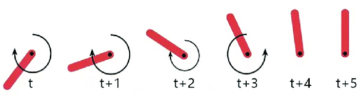
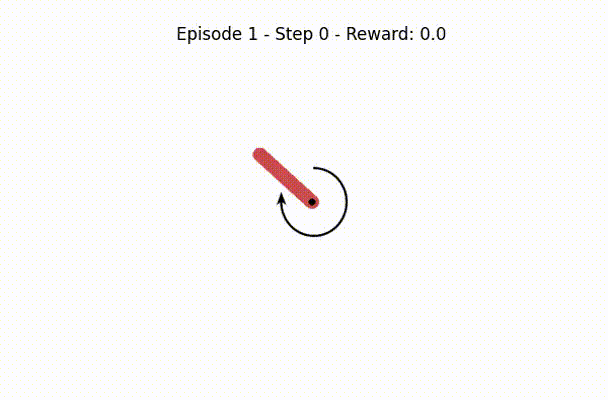

# 🧭 Pendulum Balance DQN



**A Deep Q-Network (DQN) agent trained to stabilize an inverted pendulum using OpenAI Gym's Pendulum-v1 environment.**  
*Explores reward shaping, action discretization, and performance criteria balancing stability and speed.*

---

## 🧩 Features

- 🎯 **Deep Q-Network Agent**: Learns to balance the pendulum in a continuous action space.  
- ⚖️ **Reward Shaping**: Custom reward functions to guide the agent's learning process.  
- 🧮 **Action Discretization**: Converts continuous actions into discrete choices for the DQN.  
- 📊 **Performance Metrics**: Evaluates agent performance based on stability, speed, and learning efficiency.  

---

## 📚 Dataset

- **Environment**: [OpenAI Gym's Pendulum-v1](https://www.gymlibrary.ml/environments/classic_control/pendulum/)  
  - **State Space**: Continuous (angle, angular velocity)  
  - **Action Space**: Continuous (torque applied to the pendulum)  

---

## 🏗 Model Architecture

- **Model Type**: Deep Q-Network (DQN)  
- **Input**: State vector (angle, angular velocity)  
- **Output**: Q-values for discrete actions (torque levels)  
- **Network Structure**: Multi-layer perceptron with ReLU activations  

---

## ⚙️ Installation

```bash
# Clone the repository
git clone https://github.com/4ndrrw/Pendulum-Balance-DQN.git
cd Pendulum-Balance-DQN

# Create virtual environment
python -m venv venv
source venv/bin/activate  # Windows: venv\Scripts\activate

# Install dependencies
pip install -r requirements.txt
```

## 🎥 Demo



*Watch the agent balance the pendulum.*

---

## 🛠 Tech Stack


---

## 🤝 Contributing

1. Fork the repository.  
2. Create a new branch (`git checkout -b feature-branch`).  
3. Commit your changes (`git commit -am 'Add new feature'`).  
4. Push to the branch (`git push origin feature-branch`).  
5. Open a Pull Request.


---
